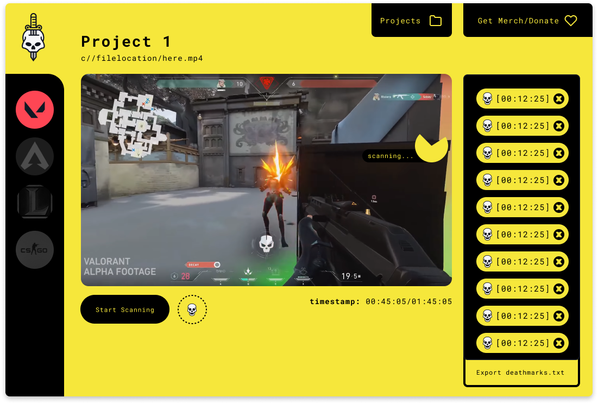

# 💀 Deathmark 🗡️
- a toy project that was created to record kills in games by checking the pixels in the kill notification areas

# Blog Post
- https://dev.to/basal/deathmark-programmatically-scan-videos-for-points-of-interest-11l1

# Video show case
https://www.youtube.com/watch?v=Ce1b5pBaWwc

)
